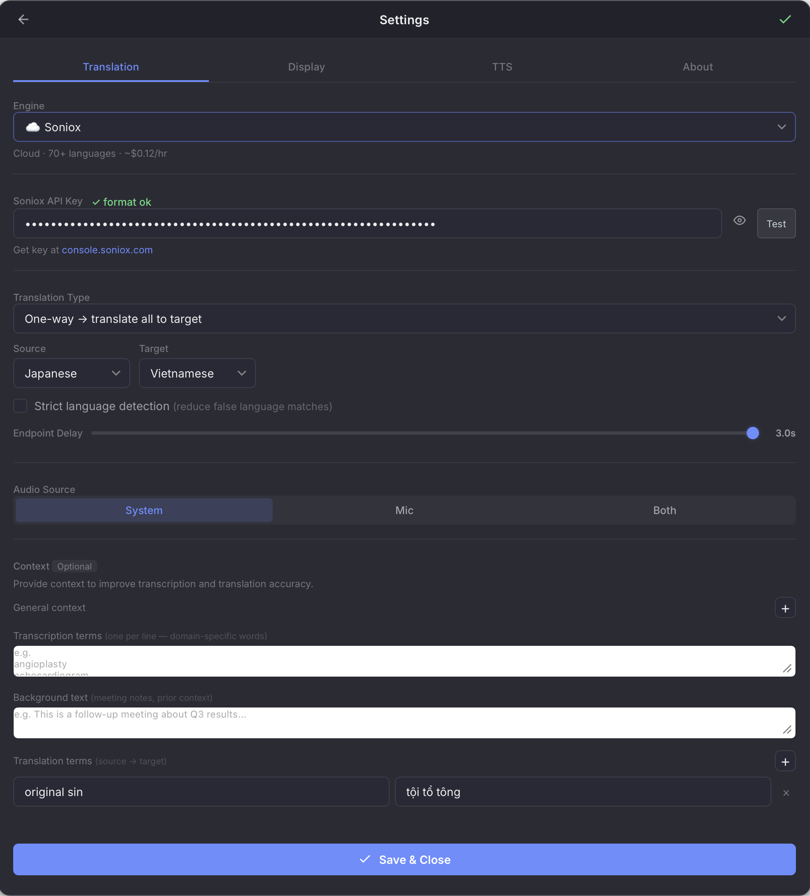
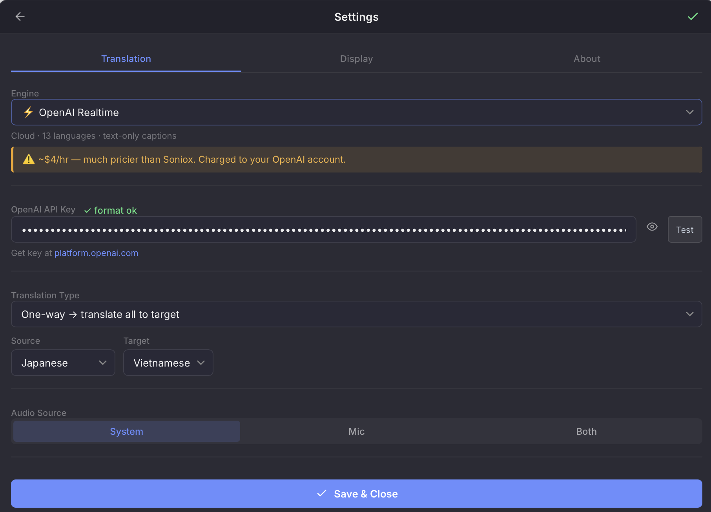
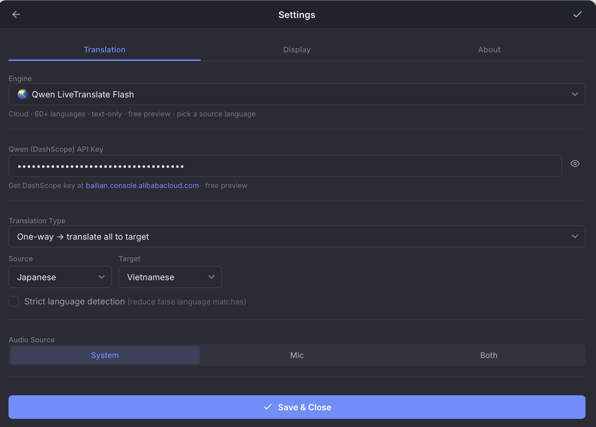
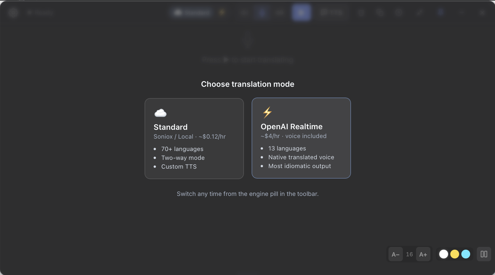
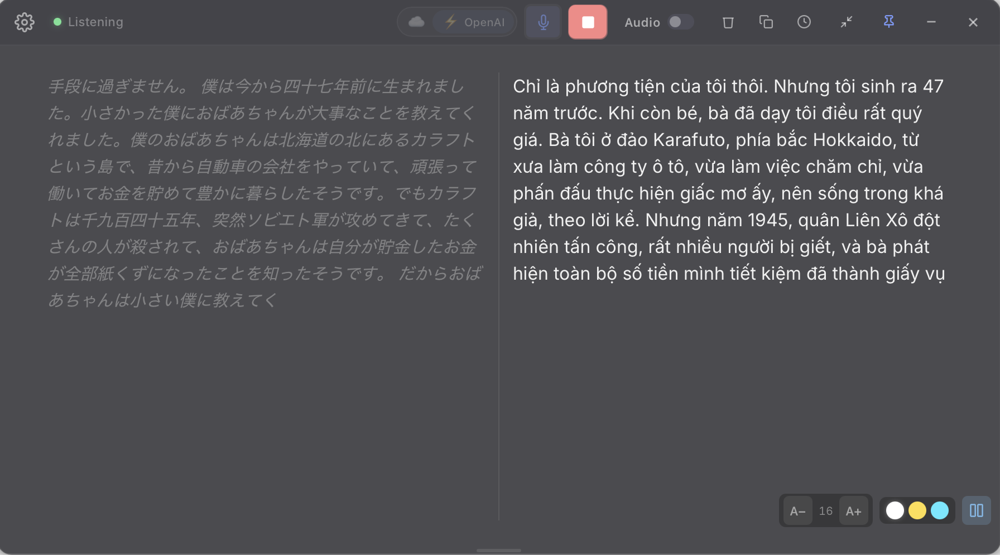

# Installation Guide

Step-by-step guide to install and use **My Translator** on macOS.

---

## Requirements

- macOS 13 or later (Apple Silicon — M1/M2/M3/M4)
- **Soniox mode** (recommended): [Soniox](https://soniox.com) API key (pay-per-use, ~$0.12/hour)
- **OpenAI Realtime mode** (premium): [OpenAI](https://platform.openai.com) API key (~$4/hour — much pricier, but returns native translated voice)
- **Local mode**: ~5 GB free disk space (for AI models, one-time download)
- **TTS narration** (optional, text engines only): See [TTS Guide](tts_guide.md) for provider options

---

## Step 1 — Download

Download the latest `.dmg` from: [**Releases — macOS**](https://github.com/phuc-nt/my-translator/releases/latest)

Choose the right file:
- `MyTranslator_x.x.x_aarch64.dmg` — Apple Silicon (M1/M2/M3/M4)
- `MyTranslator_x.x.x_x64.dmg` — Intel Mac

---

## Step 2 — Install

1. Open the `.dmg` file
2. Drag **My Translator** into the **Applications** folder
3. Eject the DMG

---

## Step 3 — First Launch

Open My Translator from Applications.

> ✅ The app is signed and notarized — macOS should allow it without any security warnings.

---

## Step 4 — Grant Screen Recording Permission

On first launch, macOS will ask for **Screen & System Audio Recording** permission:

1. Click **Open System Settings** when prompted
2. Find **My Translator** in the list
3. **Toggle the switch ON**
4. macOS will ask to **Quit & Reopen** — click that button

> This permission is required for the app to capture system audio (YouTube, Zoom, podcasts, etc.)

---

## Step 5 — Get a Soniox API Key

Soniox provides real-time speech recognition and translation.

1. Go to [console.soniox.com](https://console.soniox.com) → create an account
2. Add billing:
   - Click **Billing** in the left sidebar
   - Add a payment method
   - Add funds ($10 minimum — lasts ~80+ hours at $0.12/hour)
3. Create API key:
   - Click **API Keys** in the left sidebar
   - Click **Create API Key**
   - Copy the key (format: `soniox_...`)

> 💡 Soniox charges ~$0.12/hour of audio processed. $10 ≈ 80+ hours of translation.

After pasting the Soniox key in Settings, the **Soniox** engine becomes the active option:

---

## Step 5b — Get an OpenAI API Key (Optional)

Skip this step if you only plan to use Soniox or Local mode.

OpenAI Realtime is the **premium** engine — it returns translated text **and** translated speech audio over a single stream, so no separate TTS provider is needed. The trade-off is cost: about **$4/hour** vs Soniox's $0.12/hour (~34× more expensive at provider list rates).

1. Go to [platform.openai.com](https://platform.openai.com) → create an account
2. Add billing:
   - Click **Settings → Billing**
   - Add a payment method and add credits ($10 ≈ ~2.5 hours of translation)
3. Create API key:
   - Click **API keys** → **Create new secret key**
   - Copy the key (format: `sk-...`)

> ⚠️ **Cost warning**: OpenAI Realtime is roughly 34× pricier than Soniox. Use it for high-stakes meetings where translation quality and native voice matter. For general use, Soniox is the better default.
>
> 📊 See [**OpenAI Realtime vs Soniox benchmark**](benchmark_openai_vs_soniox.md) for a real-world comparison.

After pasting the OpenAI key in Settings, the **OpenAI Realtime** engine becomes selectable:

---

## Step 5c — Get a Qwen LiveTranslate Flash API Key (Optional, free preview)

Qwen LiveTranslate Flash (Alibaba DashScope) is the **free preview** engine — fastest of the three (~4 s first token), supports **60+ languages**, returns translated text only (no native voice, no source-transcript panel).

> ⚠️ **IMPORTANT — must pick Singapore region.** The app connects to the international endpoint `dashscope-intl.aliyuncs.com`. Keys created in other regions (China Beijing, Hong Kong, US Virginia, Germany Frankfurt) are rejected and the app raises `WebSocket error` the moment you press Start.

1. Open <https://bailian.console.alibabacloud.com> (Alibaba Cloud Model Studio).
2. **Before sign-in / sign-up**, click the region dropdown in the top-right and pick **Singapore**. If you've already signed in to another region, switch to Singapore — you may need to register a separate workspace for this region.
3. Once inside the Console (top-right still shows "Singapore"), activate the **Model Studio (DashScope)** service if prompted.
4. Go to **API Keys**, click **Create API Key**, name it anything.
5. **Copy the key immediately** — it's only shown in full once.
6. In Settings → pick the **Qwen LiveTranslate Flash** engine → paste the key.

> **Qwen Live Flash notes:**
> - **Must pick a source language** before Start. Unlike Soniox/OpenAI which auto-detect, Qwen Live needs the source language up front — the source picker automatically hides "Auto-detect" when this engine is selected.
> - **No dual-panel view** (the model returns translation only, no source transcript). Translation-only display.
> - **No native voice output / custom TTS** — avoids the speaker → mic feedback loop.
> - Currently in **free preview**. Pricing may change once it leaves preview — watch Alibaba Cloud announcements.

### Troubleshooting `WebSocket error` with Qwen

| Symptom | Common cause | Fix |
| --- | --- | --- |
| `WebSocket error` immediately on Start | Key created in a non-Singapore region | Recreate the key in Singapore (see step 2 above) |
| Error after ~5–10 seconds | Right region but Qwen Live model not enabled | Model Studio → Model Square → enable `qwen3-livetranslate-flash-realtime` |
| Translates one sentence then stalls | Source language left on "auto" | Settings → Source language → pick the actual language (e.g. Japanese) |
| Flaky errors | Network blocks `dashscope-intl.aliyuncs.com` (corp firewall / VPN) | Try a different network (4G/5G) or disable VPN |

---

## Step 6 — Configure the App

1. Click ⚙️ (or press `⌘ ,`) to open **Settings**
2. Go to the **General** tab
3. Paste your **Soniox API key** and/or **OpenAI API key** (whichever engines you want enabled)
   - A green dot ✓ next to each key field means the key format looks valid; click **Test** to ping the provider live
   - Engines without a valid key are greyed out in the dropdown
4. Choose translation type:
   - **One-way**: Select Source language and Target language
   - **Two-way**: Select Language A and Language B (for bilingual meetings — the app auto-detects and translates both directions). *Two-way is unavailable on OpenAI Realtime — use Soniox or Local for two-way.*
5. Choose Translation Engine:

| Mode | Speed | Quality | Cost | Voice output | Source transcript | Internet |
|------|-------|---------|------|--------------|-------------------|----------|
| ☁️ **Soniox** | ~2 s | 9/10 | ~$0.12/hr | Via TTS (free–$8/hr) | ✅ Yes (dual panel) | Required |
| ⚡ **OpenAI Realtime** | ~1.5 s | 9.5/10, very idiomatic | **~$4/hr** | Off by default | ✅ Yes (dual panel) | Required |
| 🌏 **Qwen LiveTranslate Flash** | ~4 s | 8/10, 60+ languages | **Free (preview)** | ❌ None | ❌ None (translation only) | Required |
| 🖥️ **Local MLX** | ~10 s | 7/10 | Free | Via TTS | ✅ Yes | Not needed |

6. Click **Save & Close**

> **Local MLX** requires Apple Silicon (M1+) and ~5 GB disk. Models are downloaded automatically on first use.
>
> **OpenAI Realtime** supports 13 target languages: en, es, pt, fr, de, it, ru, hi, id, vi, ja, ko, zh. For Thai or other languages, use Soniox. The custom TTS toggle is automatically disabled while OpenAI Realtime is selected (audio comes from the model itself).

---

## Step 7 — Enable TTS Narration (Optional)

Want translations **read aloud**? Three TTS providers are available:

| Provider | Cost | Quality | Setup |
|----------|------|---------|-------|
| 🎙️ **Edge TTS** | Free | Natural | None |
| 🌐 **Google Chirp 3 HD** | Free 1M chars/mo | Near-human | Google Cloud API key |
| ✨ **ElevenLabs** | ~$5/mo+ | Premium | ElevenLabs API key |

### Quick setup (Edge TTS — free):

1. Settings → **TTS** tab → Provider: **Edge TTS**
2. Choose a voice → **Save & Close**
3. On main screen, click the **TTS** button (or `⌘ T`) to enable

### For Google or ElevenLabs:

See [TTS Guide](tts_guide.md) for step-by-step API key instructions.

---

## Step 8 — Start Translating!

1. Go back to the main screen
2. Click ▶ (or press `⌘ Enter`) to start
3. Play any audio on your Mac (YouTube, Zoom, podcasts...)
4. Translations appear in real-time!

**View modes:**
- **Single** (default): Translation text only
- **Dual**: Source | Translation side-by-side (toggle with panel button, bottom-right)

**Font size:** Use A-/A+ buttons (bottom-right on hover) to adjust

### Choosing the translation mode

If you have both a Soniox and an OpenAI key configured, the first time you start a session the app asks which engine to use:

You can switch any time from the engine pill in the toolbar.

### Dual-panel view with OpenAI Realtime

In **Dual** view the source transcript appears on the left and the translated text on the right — OpenAI's whisper transcription and translated output stream side-by-side:

---

## Keyboard Shortcuts

| Shortcut | Action |
|----------|--------|
| `⌘ Enter` | Start / Stop |
| `⌘ ,` | Open Settings |
| `Esc` | Close Settings |
| `⌘ 1` | Switch to System Audio |
| `⌘ 2` | Switch to Microphone |
| `⌘ T` | Toggle TTS narration |

---

## Troubleshooting

### No translation text appears
→ Check **Screen & System Audio Recording** is enabled in System Settings (see Step 4)

### "No API key" error
→ Open Settings (⚙️) and paste a Soniox key (Step 5) and/or an OpenAI key (Step 5b) for whichever engine you selected

### OpenAI Realtime: engine option is greyed out
→ The OpenAI key field is empty or the key format is invalid (must start with `sk-`). Paste a fresh key, then click **Test** to verify

### OpenAI Realtime: "Two-way" toggle is hidden
→ This is expected. Two-way mode is only available on Soniox and Local MLX. Switch engines if you need it

### Translation cost is much higher than expected
→ Confirm which engine you're using. OpenAI Realtime is ~$4/hour vs Soniox's ~$0.12/hour. The engine indicator shows under the dropdown in Settings

### "No microphone found" error
→ Mac Mini has no built-in microphone. Connect an external mic (USB, headset, AirPods)

### TTS not working
→ See [TTS Guide — Troubleshooting](tts_guide.md#troubleshooting)

---

## Updating

My Translator includes **auto-update**. When a new version is available:

1. A **green badge** appears on the ⚙️ settings icon
2. Open Settings → **About** tab → click **Download & Install**
3. The app will restart automatically with the new version

No need to download DMG files manually for future updates!
